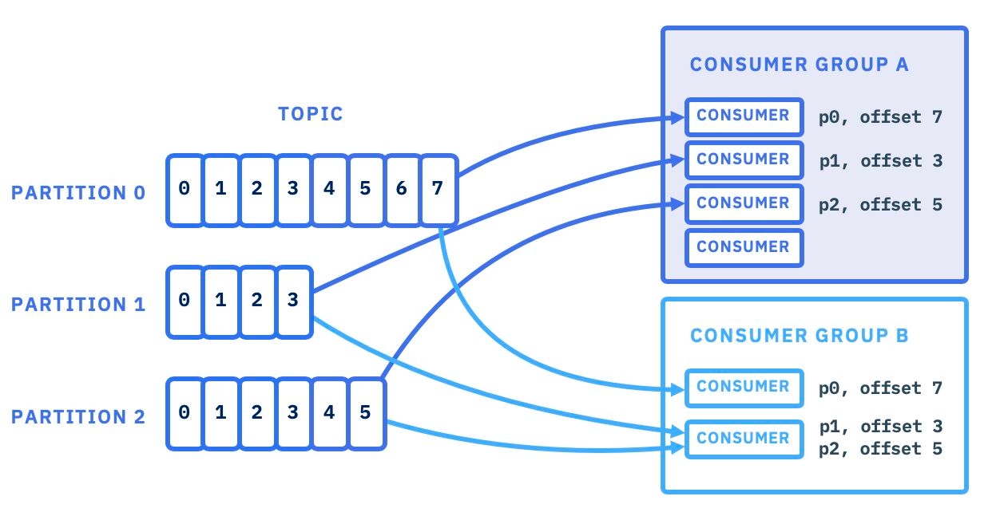

# ELI5 Kafka’s Consumer Group Protocol
Imagine you have this amazing system where messages are constantly flowing, and you want different applications to consume and process those messages efficiently. Well, that's where consumer groups step in to save the day! 🦸‍♀️🦸‍♂️

The main idea behind consumer groups is to make sure that each message is processed only once and that multiple applications don't consume from the same source for too long. To achieve this, the system uses a process called consumer group rebalancing. 🔄

Basically Consumer Group Rebalances happens to reassign the partition to consumer mapping.
So, when does a rebalance occur?
1. when an old consumer goes offline
2. a new consumer boots up to join the group
3. when a consumer leaves the group

So far so good, right?
Now to keep everything organized, the system needs a way to let each application know which parts of the message stream they are responsible for. This is where the Group Coordinator and Group Leader come into play.

Think of Group Coordinator as a POC for the given consumer group.

Group Coordinator
1. Maintains the membership of the group and coordinates them during rebalancing.
2. It also handles requests from applications to save their progress in the message stream. It does so by accepting the special OffsetCommit requests from consumers.
   This data is stored in an internal topic named `__consumer_offsets`. This topic also contains metadata about the group, so that the coordinator can fail over appropriately if it dies.

Now let's talk about Group leader.

Each application group is assigned a specific portion of the __consumer_offsets topic to keep track of their own progress. The leader of that assigned portion becomes the Group Coordinator for that particular application group. They hold the power to assign different parts of the message stream to each application during the rebalancing dance. 🎩🕺💃

Whoa, that was long! Let me summarise:
Consumer groups ensure efficient message consumption for different applications.
The Group Coordinator acts as a coordinator for the group, keeping track of its members and handling progress updates.
The Group Leader assigns parts of the message stream to each application during rebalancing.
Together, they help maintain a smooth and organized message processing system. 🌟💌

