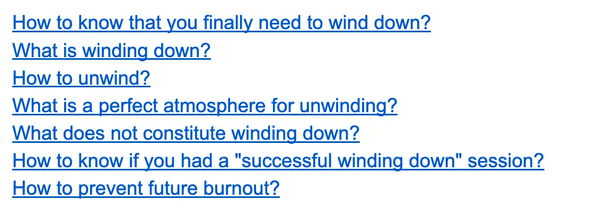
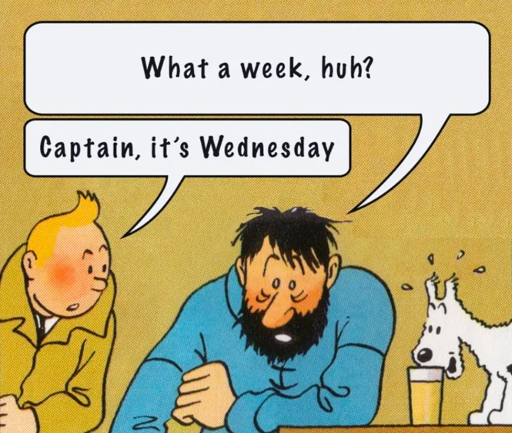

# Beyond Burnout: A Guide to Purposeful Unwinding

## How to know that you finally need to wind down?
You were working relentlessly for extended periods, and now that desire to persist diminishes. A sentiment previously brushed aside demands attention. You can no longer continue with the same ferocity.

You were _attending the meetings_. _Talking to the customers_. _Buying groceries_ for your house. _Witnessing the coup in Somalia live_ and a 1000 other things.

All of this has left your brain cooked. It is overloaded and it needs time to relax.

Coding, writing, composing music — or whatever that you used to do so effortlessly earlier — now feels like an insurmountable task. The efficiency you once had is slipping away.

If you’re experiencing this, it’s a clear indication that it’s time to _wind down_.

## What is winding down?
There is no set definition to it, but it involves taking a break from your routine. Doing things that you should be doing regularly for relaxation, but you were neglecting them.

Relaxing on the couch while enjoying bourbon and jazz.

Or watching an old rom-com wearing a face mask in a bathrobe.

Perhaps sitting on the floor to read a book while listening to music. _But_ not actually reading it. Intermittently pausing to reflect back on yourself. Pausing to think about your life. Your relationships. The occasional dread you feel. Or thinking about your anxiety.

All of the above activities can be used as a facade to wind down. It’s less about the activity that you are doing, and more about providing yourself some space to unwind.

## How to unwind?
Like all complex questions, the answer to this question is also _“it depends”_ or _“there is no right answer"_.

At its core, winding down involves engaging in an activity that, as a result, rejuvenates you.

The art lies in choosing an activity that recharges you without draining you. Some activities recharge you but in the due process, they need a lot from you. You need something which gives back more than it takes.

It could be anything ranging from — _Relaxing on the couch while enjoying bourbon and jazz, watching rom-com…_ You get the gist, right?

For the sake of this essay, I will pick book reading as an example.

## What is a perfect atmosphere for unwinding?
You are sitting on the floor, with a Kindle in your hand — a book is opened that you wanted to read for a long time but had no time to read. Some soft music plays from your laptop. A yellow table lamp is lit up behind your external monitor on which you usually code. But surprisingly today, it does not have the usual IDE open there. From the floor, you can not see the black terminal screen that you are so used to seeing. The screen is just turned off.

You finally open your book and start reading it. You read 2 pages and a clamor starts in your head. You hear your fears and anxieties. You get reminders of unfinished tasks. _“Not today”_, you say to yourself. Today you just sit and read your damn book, or at least pretend to.

Although you are allowed to think about them — jot them down or record voice notes, or heck, even record a video (considering all these social media influencers seem to do it) — how hard can it be? After all, you are a rockstar. But remember not to fall prey to doom-scrolling again. Be vigilant. Perhaps put the phone on airplane mode while using it.

What you will realize is that you are no longer reading the book for knowledge. You are reading it so it takes you on a journey wherein you have the space to reflect. The space you did not have before, as you were busy ticking off items from your to-do list.

Now that you have a moment of self-reflection, indulge in it. This self-reflection is not explicit, but rather implicit. Reading that book is like white noise for you.

It is similar to listening to a podcast while you are washing dishes. Or like the music which is playing inside the hall, while you are out on the balcony late at night with your crush at a house party. Books, Podcasts, music — all of these are the not-so-important main facade activities. But you need them as crutches, so you can do what should be done — _unwind_.

Suddenly you look at the clock, you realize that it’s been 1.5 hours and you have only progressed 20 pages. But your diary is filled with notes, and your phone with voice recordings. The ice cream tub that you had at the start of this session is half empty.

Don’t beat yourself up for just reading 20 pages. Remember it’s not about the number of pages you read; it is about winding down.

## What does not constitute winding down?
The choice of activity for winding down is a personal one.

Mindless scrolling or browsing reels, might appear tempting but will overload you with unnecessary information, proving counterproductive.

Instead, consider activities that encompass both mental and physical elements, offering a more holistic approach to relaxation. Engaging in physical activities like long walks and sports can aid in unwinding. Exploring creative outlets such as pottery can provide valuable avenues to relax while engaging both your mind and body.

Alternatively, you can choose to retreat to the comfort of your room. Inside your room, you have created a den. A den in which the lion is resting and rejuvenating before he comes out to hunt again. You, my friend, embody that lion. And this is your time to unwind.

## How to know if you had a “successful winding down” session?
Successful winding down leaves you feeling lighter. You feel as if the world is not crashing down anymore.

You find yourself unintentionally recording voice notes or scribbling reflections about the things which were bothering you. You did not do it consciously, It just came to you.

Prima Facie, you were indulged in book reading, remember? But by the act of book reading, you found the space that you so desperately needed but you were denying yourself.

You enjoyed the good music. You liked the taste of that ice cream. Although you do not remember what you read in the past few hours and you can not put your finger on what you achieved. But you just feel slightly better.

This break isn’t a magical solution, but it does alleviate some of the burden on your shoulders. You might not remember how it all happened, but it doesn’t matter — your body found a way to wind down. Congratulations.

One session won’t fully replenish your energy levels, but it’s a step in the right direction. You need deep rest and good sleep.

## How to prevent future burnout?
Well, there is no gospel anyone can give. But you need to internalize that — breaks are important. _Duh.._ as if you did not know it.

In the short run, breaks might slow you down. But in the long run constant breaks are undeniably crucial. They keep you on track. After all, even the god took a break on Sunday after creating humans for 6 days. You are merely a human, my friend. So relax and keep taking breaks.

Enjoy Sundays. If you can not afford to enjoy the entire Sunday. At least keep the Saturday evening for yourself. Take some time off from the chaos of the world to look deep inside. Whether it’s a long nap, a sitcom binge, or simply enjoying a quiet evening with a glass of wine. You deserve it.

